<div align="center">

# ⚡ MUHAMMAD TALAL ILYAS
### **AI Systems Architect & Senior Full-Stack React Engineer**
*BS in Artificial Intelligence • Autonomous Agentic Pipelines • Sub-Second React/Next.js Architectures*

[](https://talal-ai-portfolio.web.app/)
[](https://wa.me/923000000000?text=Hi%20Muhammad%20Talal%20Ilyas,%20I%20reviewed%20your%20GitHub%20and%20would%20like%20to%20hire%20you)
[](https://linkedin.com/in/talal-ilyas-76274531a)
[](mailto:talalilyas11@gmail.com)

```
┌──────────────────────────────────────────────────────────────────────────────────────────────────┐
│  CORE EXPERTISE: Autonomous LLM Agents • AST Parsing • React 18 / Next.js 14 • Redux Toolkit     │
│  CLOUD RUNTIME:  Google Cloud (SSD Edge CDN) • Docker Sandboxing • Supabase PostgreSQL           │
│  AVAILABILITY:   Full-Time Remote Engineering & High-Impact Consulting Worldwide                 │
└──────────────────────────────────────────────────────────────────────────────────────────────────┘
```

</div>

---

## 🏛️ Executive Summary & Engineering Philosophy

> *"Most engineers build static UI dashboards. I architect **closed-loop autonomous systems** and **resilient full-stack applications** that diagnose failures, heal code in real time, and scale with deterministic performance."*

- 🎓 **BS in Artificial Intelligence (2023, Superior University Lahore):** Formal foundation in heuristic algorithms, Abstract Syntax Trees (AST), multi-agent coordination, and large language model inference.
- 🤖 **Flagship Autonomous System:** Engineered a self-healing developer agent with **Google Gemini 1.5 Pro** that observes test failures, extracts AST contexts, executes isolated Dockerized test gates, and commits verified patches with **0 human intervention**.
- ⚡ **Full-Stack Performance:** Built enterprise financial state machines with **Redux Toolkit normalized caching**, achieving sub-second TTFB, 100% calculation consistency, and atomic rollback on mutation drift.

---

## 🏗️ Flagship System Architecture: Self-Healing AI Agent

```mermaid
flowchart LR
    subgraph S1["1. OBSERVATION"]
        A["Watcher Daemon<br/>(Node/Jest Hook)"] -->|"Capture Stack Trace & Exit Code"| B["Failure Interceptor"]
    end

    subgraph S2["2. AST ANALYSIS"]
        B --> C["AST Parser & Scope Extractor<br/>(Babel / TS Compiler API)"]
        C -->|"Minimal Context + Assertion Diff"| D["Prompt Synthesizer"]
    end

    subgraph S3["3. LLM INFERENCE"]
        D --> E["Google Gemini 1.5 Pro<br/>(Structured Patch JSON)"]
    end

    subgraph S4["4. SANDBOXED VERIFICATION"]
        E -->|"Candidate Patch #1"| F["Docker Isolated Sandbox<br/>(Ephemeral Container)"]
        F --> G{"Test Suite Pass?<br/>(14/14 Units)"}
    end

    subgraph S5["5. SOURCE INTEGRATION"]
        G -->|"YES (100% Pass)"| H["Git Auto-Commit & Semantic Log"]
        G -->|"NO (Retry / Refine)"| D
    end

    style S1 fill:#0d1527,stroke:#3b82f6,stroke-width:2px,color:#fff
    style S2 fill:#0d1527,stroke:#06b6d4,stroke-width:2px,color:#fff
    style S3 fill:#0d1527,stroke:#8b5cf6,stroke-width:2px,color:#fff
    style S4 fill:#0d1527,stroke:#10b981,stroke-width:2px,color:#fff
    style S5 fill:#0d1527,stroke:#6366f1,stroke-width:2px,color:#fff
```



---

## 🌟 Production Case Studies & Systems

<table>
  <thead>
    <tr>
      <th width="50%">🤖 Autonomous Gemini Code-Fixer & Test Runner</th>
      <th width="50%">💳 Enterprise Billing & Invoice Platform</th>
    </tr>
  </thead>
  <tbody>
    <tr>
      <td valign="top">
        <p align="center">
          <a href="https://talal-ai-portfolio.web.app/projects/autonomous-gemini-code-fixer">
            
          </a>
        </p>
        <ul>
          <li><b>Problem Solved:</b> Developer downtime spent triaging repetitive regressions and type exceptions.</li>
          <li><b>Core Innovation:</b> Autonomous closed-loop feedback pipeline with AST context isolation & Gemini 1.5 Pro.</li>
          <li><b>Verification Gate:</b> Ephemeral Docker container running unit suites with zero production pollution.</li>
          <li><b>Key Metric:</b> ~2.8s automated recovery cycle; 100% test validation accuracy.</li>
        </ul>
        <div align="center">
          <code>Python</code> • <code>Google Gemini API</code> • <code>AST</code> • <code>Docker</code> • <code>Jest/PyTest</code>
        </div>
      </td>
      <td valign="top">
        <p align="center">
          <a href="https://talal-ai-portfolio.web.app/projects/enterprise-billing-invoice-platform">
            
          </a>
        </p>
        <ul>
          <li><b>Problem Solved:</b> Complex multi-currency reconciliation errors and UI lag during concurrent bulk updates.</li>
          <li><b>Core Innovation:</b> Normalized Redux Toolkit state machine with atomic rollback on mutation failures.</li>
          <li><b>Performance:</b> 20% client page-load latency reduction with sub-second calculations.</li>
          <li><b>Data Integrity:</b> 100% calculation consistency across volatile network profiles.</li>
        </ul>
        <div align="center">
          <code>React 18</code> • <code>Next.js 14</code> • <code>Redux Toolkit</code> • <code>TypeScript</code> • <code>Tailwind</code>
        </div>
      </td>
    </tr>
  </tbody>
</table>

---

## 🛠️ Technology Stack & Architectural Competencies

```
┌─────────────────────────┬────────────────────────────────────────────────────────────────────────┐
│ DOMAIN                  │ TECHNOLOGIES & TOOLS                                                   │
├─────────────────────────┼────────────────────────────────────────────────────────────────────────┤
│ 🧠 Agentic AI & LLMs    │ Google Gemini 1.5 Pro, OpenAI GPT-4o, LangChain, RAG Pipelines, AST    │
│ ⚡ Frontend Systems     │ React 18, Next.js 14 (App Router), TypeScript, JavaScript (ES6+), CSS3 │
│ 🔄 State Management     │ Redux Toolkit, createSelector (Reselect), Context API, TanStack Query │
│ 🗄️ Backend & Databases  │ Node.js, Express.js, Supabase, PostgreSQL, REST APIs, GraphQL          │
│ ☁️ Cloud & DevOps       │ Google Cloud Platform, Firebase Hosting, Docker, Vercel, GitHub CI/CD  │
│ 🧪 Testing & Quality    │ Jest, React Testing Library, PyTest, Automated Regression Harnesses    │
└─────────────────────────┴────────────────────────────────────────────────────────────────────────┘
```

---

## 📐 Enterprise Architecture Principles

```typescript
interface ArchitecturalPrinciples {
  modularity: 'Domain-Driven Component Isolation & Separation of Concerns';
  statePurity: 'Normalized O(1) Redux Slices with Idempotent Server Reconciliation';
  typeSafety: 'Strict End-to-End TypeScript Contracts (Zero `any` Pragmas)';
  observability: 'Telemetry Logging & Sandboxed Validation on Autonomous LLM Calls';
  availability: 'Worldwide Remote (US, EU, PK Timezone Overlaps)';
}
```

---

## 📬 Contact & Engineering Consultation

<div align="center">

Whether you need an **autonomous AI agent pipeline**, a **high-performance React/Next.js frontend**, or a **senior full-stack systems engineer**:

[](https://talal-ai-portfolio.web.app/)
&nbsp;&nbsp;
[](https://wa.me/923000000000?text=Hi%20Muhammad%20Talal%20Ilyas,%20I%20want%20to%20hire%20you)
&nbsp;&nbsp;
[](mailto:talalilyas11@gmail.com)

<br/>

```
© 2026 Muhammad Talal Ilyas • Built with Next.js, TypeScript & Google Cloud
```

</div>
