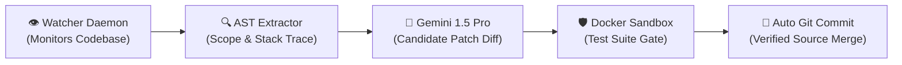

<div align="center">

  <!-- 3D Cyberpunk Gradient Header Banner -->
  

  <!-- Animated Dynamic Typing Headline -->
  <a href="https://talal-ai-portfolio.web.app/">
    
  </a>

  <br/><br/>

  <!-- High-Contrast 3D Glassmorphic Action Badges -->
  <p align="center">
    <a href="https://talal-ai-portfolio.web.app/">
      
    </a>
    &nbsp;
    <a href="https://wa.me/923000000000?text=Hi%20Muhammad%20Talal%20Ilyas,%20I%20reviewed%20your%20GitHub%20and%20would%20like%20to%20hire%20you%20for%20a%20project">
      
    </a>
    &nbsp;
    <a href="https://linkedin.com/in/talal-ilyas-76274531a">
      
    </a>
    &nbsp;
    <a href="mailto:talalilyas11@gmail.com">
      
    </a>
  </p>

</div>

---

### 🚀 **Executive Summary & Client Value Proposition**

> *"Most developers build static UI templates. I engineer **autonomous agentic pipelines** and **high-scale React frontends** that self-heal code, automate complex financial logic, and eliminate runtime bottlenecks."*

```yaml
Name: Muhammad Talal Ilyas
Title: AI & Full-Stack React Engineer | Agentic Systems & LLMs
Education: Bachelor of Science in Artificial Intelligence (BS AI, 2023)
Flagship: Autonomous Closed-Loop Self-Healing AI Code Agent (Gemini 1.5 Pro)
Production Stack: React 18, Next.js 14, TypeScript, Redux Toolkit, Supabase, Node.js, Docker
Hosting: Google Cloud Platform (SSD Edge CDN)
Availability: Open for Full-Time Remote Roles & High-Impact Contracts Worldwide
```

---

### 🌟 **Flagship Engineering Showcase**

<table>
  <tr>
    <td width="50%" valign="top">
      <div align="center">
        <h3>🤖 Autonomous Gemini Code-Fixer</h3>
        <a href="https://talal-ai-portfolio.web.app/projects/autonomous-gemini-code-fixer">
          
        </a>
      </div>
      <br/>
      <ul>
        <li><b>Self-Healing Agent:</b> Observes codebase regressions in real time.</li>
        <li><b>AST Scope Isolation:</b> Extracts context & prompts <b>Google Gemini 1.5 Pro</b> for candidate patches.</li>
        <li><b>Sandbox Gate:</b> 100% Dockerized unit test verification before auto-commit.</li>
        <li><b>Recovery Cycle:</b> ~2.8s end-to-end automated fix.</li>
      </ul>
      <p align="center">
        <code>Python</code> • <code>Gemini 1.5 Pro</code> • <code>AST</code> • <code>Docker</code> • <code>PyTest</code>
      </p>
    </td>
    <td width="50%" valign="top">
      <div align="center">
        <h3>💳 Enterprise Billing & Invoice Platform</h3>
        <a href="https://talal-ai-portfolio.web.app/projects/enterprise-billing-invoice-platform">
          
        </a>
      </div>
      <br/>
      <ul>
        <li><b>Complex State Machine:</b> Multi-tier tax brackets & multi-currency reconciliation.</li>
        <li><b>Normalized Redux Cache:</b> $O(1)$ client-side lookups with 0 race conditions.</li>
        <li><b>Performance:</b> 20% reduction in client page load latency.</li>
        <li><b>Data Integrity:</b> Atomic rollback on network mutation failures.</li>
      </ul>
      <p align="center">
        <code>React 18</code> • <code>Redux Toolkit</code> • <code>TypeScript</code> • <code>Tailwind CSS</code>
      </p>
    </td>
  </tr>
</table>

---

### 🏗️ **5-Stage Autonomous Agent Pipeline Architecture**



---

### 🛠️ **Technical Skill Matrix & Tooling**

<div align="center">

| Engineering Domain | Technologies, Libraries & Tools |
| :--- | :--- |
| **🧠 Agentic AI & LLMs** | `Google Gemini 1.5 Pro` `OpenAI GPT-4o` `LangChain` `RAG Architectures` `AST Code Parsers` `Prompt Engineering` |
| **⚡ Frontend & React** | `React 18` `Next.js 14 (App Router)` `TypeScript` `JavaScript (ES6+)` `HTML5 / CSS3` `Tailwind CSS` |
| **🔄 State & Data Flow** | `Redux Toolkit` `createSelector (Reselect)` `React Context API` `TanStack Query` `Zustand` |
| **🗄️ Backend & Databases** | `Node.js` `Express.js` `Supabase` `PostgreSQL` `REST APIs` `GraphQL` |
| **☁️ DevOps & Cloud** | `Google Cloud Platform` `Firebase Hosting` `Docker` `Vercel` `Git & GitHub Actions CI/CD` |

</div>

---

### 📊 **3D GitHub Analytics & Activity Stream**

<div align="center">

  <table border="0">
    <tr>
      <td>
        
      </td>
      <td>
        
      </td>
    </tr>
  </table>

  

</div>

---

### 🤝 **Why Engineering Teams & Clients Hire Me**

```typescript
interface ClientValueProposition {
  communication: 'Asynchronous + Synchronous (US, EU, PK Timezone Overlaps)';
  turnaroundVelocity: '+25% Faster Feature Delivery with Clean Modularity';
  codeStandards: '100% Type-Safe TypeScript, Zero Runtime Drift, Sub-Second Performance';
  aiCapability: 'Formal AI Degree (BS AI) + Production Self-Healing Loops';
  contractAvailability: 'Immediate (Full-Time Remote / Contract)';
}
```

---

<div align="center">

  ### 📬 **Let's Build Something High-Impact Together**

  <p>
    Looking for a <b>senior AI & full-stack React engineer</b> to lead product development or engineer autonomous agent pipelines?
  </p>

  <a href="https://talal-ai-portfolio.web.app/">
    
  </a>
  &nbsp;&nbsp;
  <a href="https://wa.me/923000000000?text=Hi%20Muhammad%20Talal%20Ilyas,%20I%20want%20to%20hire%20you%20for%20a%20project">
    
  </a>
  &nbsp;&nbsp;
  <a href="mailto:talalilyas11@gmail.com">
    
  </a>

  <br/><br/>
  
  

</div>
